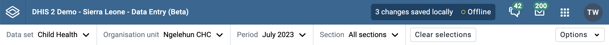

# Custom Connection Status Message

By default, the header bar shows either an "Online" or "Offline" message based on whether the app can connect to the DHIS2 server. If it's useful for an app to share other relevant info in that badge, for example "3 changes saved locally", then it's possible to set a custom message there:



## Hooks

```ts
import {
    useSetOnlineStatusMessage,
    useOnlineStatusMessageValue,
    useOnlineStatusMessage,
} from '@dhis2/app-runtime'
```

### `useSetOnlineStatusMessage`

It's most likely that you'll only use `useSetOnlineStatusMessage()`, a hook that returns a `setState` function. It can set the value in the Header Bar without causing a rerender for itself.

`setOnlineStatusMessage()` accepts a `ReactNode`-type object, so icons or other components can be added to the badge, but don't go crazy. A simple string is also a valid `ReactNode`:

```ts
const setOnlineStatusMessage: (message: ReactNode) => void =
    useSetOnlineStatusMessage()
```

### `useOnlineStatusMessageValue`

This hook returns just the value:

```ts
const onlineStatusMessage: ReactNode = useOnlineStatusMessageValue()
```

### `useOnlineStatusMessage`

This hook returns both the value and the `set` function:

```ts
const { onlineMessage, setOnlineStatusMessage } = useOnlineStatusMessage()
```

## Example

You can see an example in use in the [Aggregate Data Entry app](https://github.com/dhis2/aggregate-data-entry-app/blob/dadd61392ea010a8017a19a25eaf76f885d9eea7/src/data-workspace/use-handle-headerbar-status.js)
