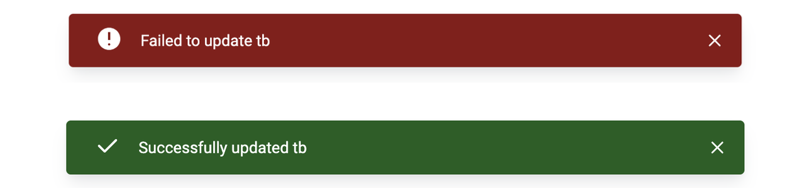

To display an alert in your web application, you will need to use the Alert Component from the `@dhis2/ui` library. However, you do not need to install this library as the best practice is to display the alert using the `useAlert` hook from the `@dhis2/app-runtime` library.

In this guide we'll walk you through, step by step, how to display an alert in your application and handle the different alerts states.

## Prerequisites

To be able to implement the alert in your application, you need to have the following:

- A web application built using the DHIS2 Application Platform
- A basic understanding of React hooks
  
If you do not yet have a web application built using the DHIS2 Application Platform, you can follow the [Getting Started](/docs/quickstart/quickstart-web) guide to create a new application.

## Step 1: Import the `useAlert` hook

The `useAlert` hook is a custom hook provided by the `@dhis2/app-runtime` library. To use it, you need to import it in your file.

```js
import { useAlert } from '@dhis2/app-runtime'
```

Now that you have imported the `useAlert` hook, you can use it in your component.

## Step 2: Send a default alert notification

Now that you have imported the `useAlert` hook, you can use it to send a default alert notification. The `useAlert` hook returns an object with two functions: `show` and `hide`.

The `show` function is used to display the alert, while the `hide` function is used to hide the alert. After hiding (automatically or by code), the alert will be removed from the alert stack. But you can re-add it by calling the `show` function again. 

```js
const App() => {
    // highlight-start
    const { show, hide } = useAlert('This is a default alert message')
    // highlight-end

    // Display the alert, somewhere later in your code
    // highlight-start
    show()
    // highlight-end
}
```

To hide the alert, you can call the `hide` function, anywhere in your code where you have access to the `hide` function.

```js
const App() => {
    // [...]
    // highlight-start
    hide()
    // highlight-end
}
```

## Step 3: Adding options to the alert

You can also add options to the alert, such as the duration of the alert, the type of alert, and the action to be taken when the alert is clicked. 

```js
const App() => {
    // highlight-start
    const { show, hide } = useAlert('This is a default alert message', {
        duration: 30000, // 30 seconds
        critical: true, // show the alert as critical
        permanent: true // don't auto-hide the alert
    })
    // highlight-end
}
```

:::info All Options
You can see the full list of options in the [AlertBar component documentation](/docs/ui/components/alertbar#props).
:::

## Step 4: Displaying dynamic alerts

You can also display dynamic alerts by passing a function to the `useAlert` hook. This function will receive the arguments passed to the `show` function.

The code below will be capable of displaying alerts with different messages and options depending on the arguments passed to the `show` function. Two of the states represented, in the image below:



The first state is a critical alert with the message `Failed to update tb`, while the second state is a success alert with the message `Successfully updated tb`.

```js
const App() => {
    // highlight-start
    const { show, hide } = useAlert(
        ({ program, success }) => (success ? `Successfully updated ${program}` : `Failed to update ${program}`),
        ({ success }) => isActive ? { critical: true } : { success: true }
    )
    // highlight-end
    
    // Display the alert, somewhere else in your code
    // highlight-start
    show({ program: 'tb', success: true })
    // highlight-end
}
```

In the example above, the alert message will be displayed as `Failed to update tb` and will be shown as critical. However, if you were to call the `show` function with `success: true`, the alert would show with a success state and the message `Successfully updated tb`. Updating the name will also change the message displayed in the alert dynamically.

This allows you to configure the Alert once and reuse it with different messages and options depending on the state of your application.

## Conclusion

In this guide, you learned how to display alerts in your application using the `useAlert` hook from the `@dhis2/app-runtime` library. You also learned how to handle different alert states and display dynamic alerts. You can now use this knowledge to display alerts in your application and provide feedback to your users.

You can read more about the `useAlert` hook in the [official documentation](/docs/app-runtime/hooks/useAlert), and find all properties to be used in the `AlertBar` component in the [AlertBar documentation](/docs/ui/components/alertbar#props).

## Additional Resources

- [AlertBar Component Documentation](/docs/ui/components/alertbar)
- [AlertBar Demo](pathname:///demo/?path=/story/alert-bar--states)